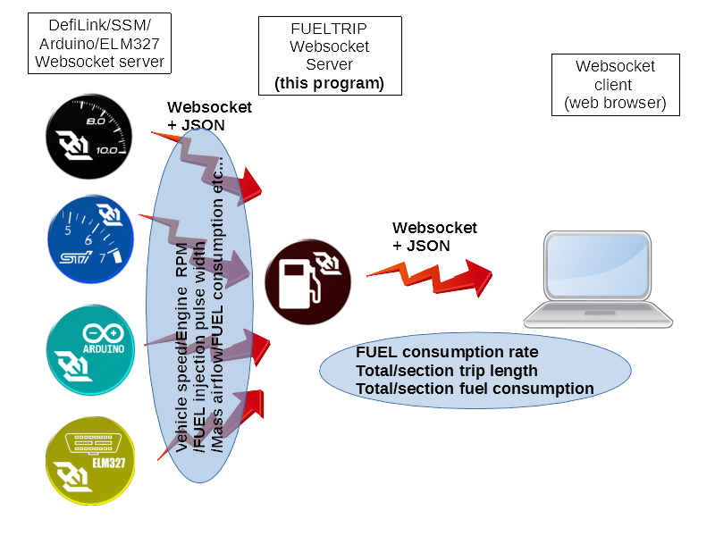
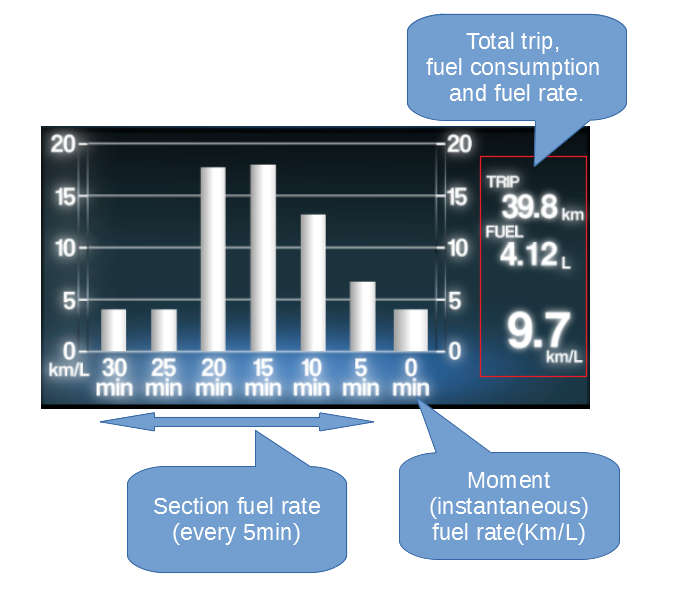

# FUELTRIP logger

## Introduction.
This program is websocket server to calculate fuel consumption/trip distance from the informatuon of ECU or sensor, and distribute fuel/trip information via websocket.


## Features
* Calculate trip distance (in kilometer) by the vehicle speed.
* Calculate fuel consumption.
	* Four types of calculation method is currently available (see below).
* Calculate fuel rate (kilometer per liter).
* Record "section" trip distance/fuel consumption/fuel rate.
* Save total trip length and fuel consumption to disk (by every 5 seconds(default)). The saved trip/fuel consumption are recalled every time on restarting the FUELTRIP logger program.



## Quick setup
The program setting is describen in `fueltriplogger_settings.xml`. For quick setup, four pattern of example setting files are prepaired in `./setting_examples` folder. Choose one of the example setting files and copy (overwrite) to `fueltriplogger_settings.xml`.

| ECU communication | Fuel calculation method | Setting file name | Description |
|--------|--------|--------|--------|
| ELM327 | FUEL RATE | `fueltriplogger_settings.ELM327.FUELRate.Sample.xml` | This method read fuel comsumption rate from ECU directly. If the ECU support "Engine Fuel Rate" PID (5E), this method shold be most acculate.|
| ELM327 | MASS AIR FLOW | `fueltriplogger_settings.ELM327.MAF.Sample.xml` | This method estimate fuel consumption from mass air flow (with estimating A/F ratio of 14.7). If the "Engine fuel ratio" PID is not available, use this. |
| SSM(subaru only) | Engine RPM and fuel injection pulse width | `fueltriplogger_settings.SSM.InjRPM.Sample.xml` | This method calculate fuel consumption from fuel injection pulse width and engine RPM. Please check and modify the number of engine cylinder, injector capacity and injection latency. (Default value is for JDM Impreza WRX STI (GDBA, EJ207)) |
| SSM(subaru only) | MASS AIR FLOW | `fueltriplogger_settings.SSM.MAF.Sample.xml` | This method estimate fuel consumption from mass air flow (with estimating A/F ratio of 14.7). |

On the setting xml file, scaling factor of trip/fuel consumption are available in `<CalculationOption>` tag. With this scaling factor, you can calibrate the cauculated trip/fuel consumption with actual values.
```xml
<CalculationOption>
  <FuelCorrectionFactor>1.0</FuelCorrectionFactor>
  <TripCorrectionFactor>1.0</TripCorrectionFactor>
</CalculationOption>
```
## Run
On windows, please doubleclick the exe file on explorer. On linux, run with mono
```
> mono FUELTRIP_Logger.exe
```

* * *


## Appendix

### Trip calculation method.
This program calculate trip distance by following simple formula.
```
Trip distance(killometer) =  (vehicle speed(km/hr)) / 3600 / 1000 * (interval time of vehicle speed update(millisecond))
```


### Fuel consumption calculation method.
This program have 4 method to calculate fuel consumption. You can select the methdo by setting xml file (see below).

#### Injection pulse witdh + engine rpm
The first method uses the fuel injection pulse width and engnine rpm to calculate fuel consumption.
(Since fuel injection pulse width is currently available only on SSM(subaru select monitor), ECU capable of SSM (and SSM websocket server) is needed to use this method.)

Calculation formula is
```
(Fuel consumption) = (Number of cylinder) * (Engine Rev) * (InjectorCapacity) * ((injectionPulseWidth) - (InjectionLatency)) / (7.2E9) * (update interval(ms)) / 1000
```
Number of cyclinder, injector capacity, injection latency is identical to the engine. These paameter can be set to the setting xml file.

#### Mass air flow.
The second method estimate the fuel consumption from engine mass air flow rate.
This method assumes air/fuel ratio (A/F ratio) is 14.7 (stoichiometric mixture). However in acutal, the A/F ratio may sometimes deviate from this value, and therefore this method may have error.

Mass air flow rate data is available on SSM and ELM327.
The calcualtion formula is ,
```
(Fuel consumption) = massAirFlow / 14.7 / (DensityOfFuel = 0.73) / 1000 * (update interval time) / 1000
```

#### Mass air flow and A/F ratio
The third method uses mass air flow and A/F ratio. This method is similar to the second method. However this method may be more acculate since actual A/F ratio is used for the calculation.

The calcualtion formula is ,
```
(Fuel consumption) = massAirFlow / (A/F ratio) / (DensityOfFuel = 0.73) / 1000 * (update interval time) / 1000
```

#### Fuel rate
The forth method uses fuel rate directly. Of cause, this method is most acculate if the ECU support reading fuel rate.
Fuel rate information is currently available on ELM327 (and ECU need to support fuel rate PID)

### Setting xml
This program reads setting xml file (`fueltriplogger_settings.xml`) at the startup.
```xml
<?xml version="1.0" encoding="utf-8" ?>
<AppSettings xmlns:xsi="http://www.w3.org/2001/XMLSchema-instance" xmlns:xsd="http://www.w3.org/2001/XMLSchema">
  <defiserver_url>ws://localhost:2012/</defiserver_url>
  <ssmserver_url>ws://localhost:2013/</ssmserver_url>
  <arduinoserver_url>ws://localhost:2015/</arduinoserver_url>
  <elm327server_url>ws://localhost:2016/</elm327server_url>
  <websocket_port>2014</websocket_port>
  <keepalive_interval>60</keepalive_interval>
  <Calculation>
    <!-- 
      Fuel calculation method. Candidates :
      RPM_INJECTION_PW : Calculate by "Engine RPM" and "Fuel injection pulse width".
      MASS_AIR_FLOW    : Calculate by "Mass air flow" (with assuming A/F ratio is 14.7)
      MASS_AIR_FLOW_AF : Calculate by "Mass air flow" and "A/F ratio"
      FUEL_RATE        : Calucluate by "Fuel Rate"
    -->
    <FuelCalculationMethod>RPM_INJECTION_PW</FuelCalculationMethod>s
    <DataSource>
      <!-- Data source (Websocket server type) Candidate : 
        DEFI : Only "Engine RPM" is available
        SSM : "VehicleSpeed", "Engine RPM", "InjectionPW", "MassAirFlow" and "AF ratio" are available.
        ARDUINO : "VehicleSpeed" and "Engine RPM" are available
        ELN327 : "VehicleSpeed", "EngineRPM", "MassAirFlow", "A/F ratio" and "FuelRate" are available (depends on ECU model) 
      -->
      <VehicleSpeedSource>SSM</VehicleSpeedSource>
      <RPMSource>DEFI</RPMSource>
      <InjectionPWSource>SSM</InjectionPWSource>
      <MassAirFlowSource>SSM</MassAirFlowSource>
      <AFRatioSource>SSM</AFRatioSource>
      <FuelRateSource>ELM327</FuelRateSource>
    </DataSource>
    <CalculationOption>
      <FuelCorrectionFactor>1.0</FuelCorrectionFactor>
      <TripCorrectionFactor>1.0</TripCorrectionFactor>
      <!--
        Follwoing 3 parmeters are considered only on "RPM_INJECTION_PW" mode.
      -->
      <NumCylinder>4</NumCylinder>
      <InjectionLatency>0.76</InjectionLatency>
      <InjectorCapacity>575</InjectorCapacity>
    </CalculationOption>
  </Calculation>
</AppSettings>
```