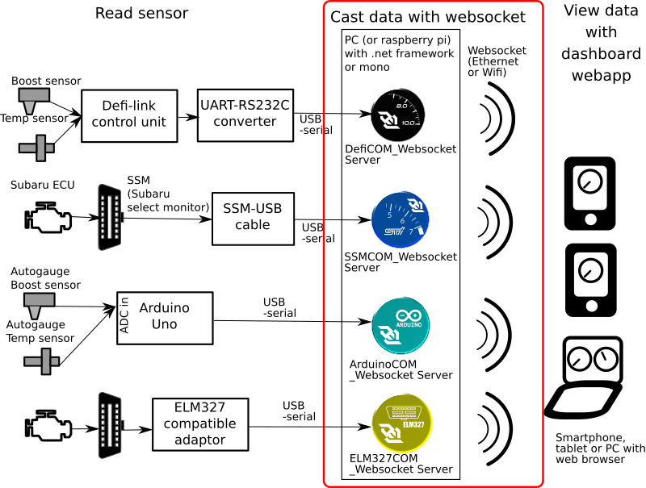

WebSocketGaugeServer
---

## Table of contents
* [Description](#description)
* [Requirement](#requirement)
* [Dependency](#dependency)
* [How to build](#howToBuild)
* [Install and setup](#installAndSetup)
* [Run](#run)
* [License](#license)

## <a name="description">Description</a>
This program reads the car sensor data (such as vehicle speed, engine rpm, water temp, boost pressure, etc..) and broadcast the data on websocket.

The data are brocasted on json format and can be viewed by dashboard webapp.
The source code of dashboard webapp is available on [sugiuraii/WebSocketGaugeClientNeo](https://github.com/sugiuraii/WebSocketGaugeClientNeo)

Currently, four types of sensors are implemented.
* Defi-Link
* SSM(Subaru select monitor)
* Arduino pulse counter (to read vehicle speed and engine rpm) + A-D converter (to read water temp, oil-temp, boost pressure, oil pressure etc..)
	* Now trying to support Autogauge boost and (water/oil) temperature sensor
* OBD-II with ELM327 (or compatible) adaptor
---


## <a name="requirement">Requirement</a>
### Software
Windows with .net Framework 4.5 or linux with mono.
### Hardware
Operation are checked on following hardware...

| Server name | Compatible controller | Developed and tested controller | Remarks |
|--------|--------|--------|--------|
| DefiCOM_WebSocket_Server | Defi-Link Control Unit-I/II  | STi Genome sport single meter (boost) | Only "Engine_Speed (rpm)" and "Manifold_Absolute_Pressure(boost)" are checked. Other sensors are not checked .<br> Not compatible with Defi-Link ADVANCE Control Unit.<br> Comport simulator software is available [here](https://github.com/sugiuraii/DefiCOM_SSMCOM_Emulator)|
| SSMCOM_WebSocket_Server | Subaru SSM capable ECU and OpenPort 1.2 compatible cable | monamona-cable and JDM Subaru Impreza WRX STI (GDBA, 2000 model) | Schematics seems to be open on [this OSDN site](https://ja.osdn.net/projects/ecuexplorer/docman/)<br> Comport simulator software is available [here](https://github.com/sugiuraii/DefiCOM_SSMCOM_Emulator) |
| ArduinoCOM_WebSocket_Server | ArduinoUNO compatible board | Nobrand ArduinoUNO compatibe board | Sketch is available on [this site](https://github.com/sugiuraii/ArduinoPulseSensorGeneratorReader).<br> This sketch is tuned for Autogauge boost sensor and temperature sensor. |
| ELM327COM_WebSocket_Server | ELM327 compatible OBD-II cable | [ScanTool.net OBDLink SX USB cable](https://www.scantool.net/obdlink-sx/) and JDM Toyota Prius (ZVW30, 2009 model) | Operation is also tested on [OBDSim]{https://icculus.org/obdgpslogger/obdsim.html} |

## <a name="dependency">Dependency</a>
* [SuperWebSocket](https://github.com/kerryjiang/SuperWebSocket)
* [WebSocket4Net](https://github.com/kerryjiang/WebSocket4Net)
* [log4net](https://logging.apache.org/log4net/)
* [Json.NET](http://www.newtonsoft.com/json)

## <a name="howToBuild">How to build</a>
The source code is written on Visual Studio 2013 Community. Open the DefiSSMCOM_Websocket.sln and select build. Required libraries shold be downloaded automatically by NuGet.

Please note that current source code cannot be built properly on "Release" or "Release_Distribution" configration. Please use "Debug_Distribution" configuration.

## <a name="installAndSetup">Install and setup</a>

If you want to install this program as linux daemon, please follow this [INSTALLLinux.md](INSTALLLinux.md)

Binary executable files are stored on DefiSSMCOM_WebsocketServer\DefiSSMCOM_Websocket\Debug_Distribution (or download the binary zip file on release page).
After copy (or extract) the binary files, please modify the setting xml file. The file name is.
* defiserver_settings.xml
* ssmserver_settings.xml
* arduinoserver_settings.xml
* elm327server_settings.xml

On these xml files, please modiy the `<comport>` tag

```
<!-- Set the COM port name where you connected the communication adaptor (defi-converter, SSM reader, Arduino or ELM327)-->
<comport>COM8</comport>
```
If you run this program on linux, please set the comport name by /dev/tty?? format, such as..
```
<comport>/dev/ttyUSB0</comport>
```

If you need, you can change the websocket portname by `<websocket_port>` tag. In the case of arduino or ELM327, you can also change the baudrate by `<baudrate>` tag.

## <a name="run">Run</a>
On windows, please doubleclick the exe file on explorer. On linux, run with mono
```
> mono DefiCOM_WebSocket_Server.exe
```

## <a name="license">License</a>
[Apache-2.0](https://github.com/sugiuraii/DefiSSMCOM_WebsocketServer/blob/master/LICENSE)
